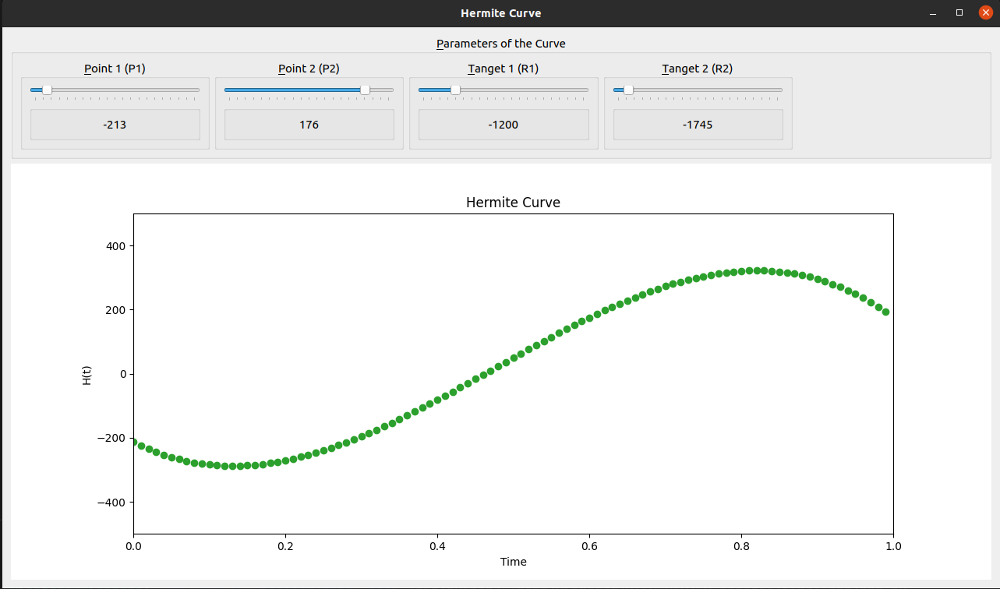

## Hermite Curve
 
 - Interative live plot of Hermite Curve with varible parameters
 - Parameters include point `P1`, `P2` and tangets at those points which are `R1` & `R2` respectively.
 - Hermite Curve is a spine curve define by `p1`, `P2`, `R1` and `R2` where `P1` & `P2` are the position vectors and `R1` & `R2` are tangets at that points.
 - Equation used to Plot the curve : `H(t) = (2t^3 - 3t^2 + 1)P1 + (-2t^3+3t^2)P2 + (t^3-2t^2+t)R1 + (t^3-t^2)R_4`
 - GUI for the Hermite Curve is devloped using PyQt5 and Matplotlib.
 
## Running file
- `cd` to the downloaded directory
- `python3 app.py` or `python app.py`
- After running the above command GUI for the plot looks like this :

## Installation of the required libraries
- `pip install PyQt5`
- `pip install matplotlib`
- `pip install numpy`

## Participants :
- Visharad
- Lokesh
- Govind

#### Slides for the presentation/ Explanation about the development of this GUI app are [Here](https://github.com/VISHARAD17/Hermite_Curve/blob/main/Hermite%20Curve.pdf)
